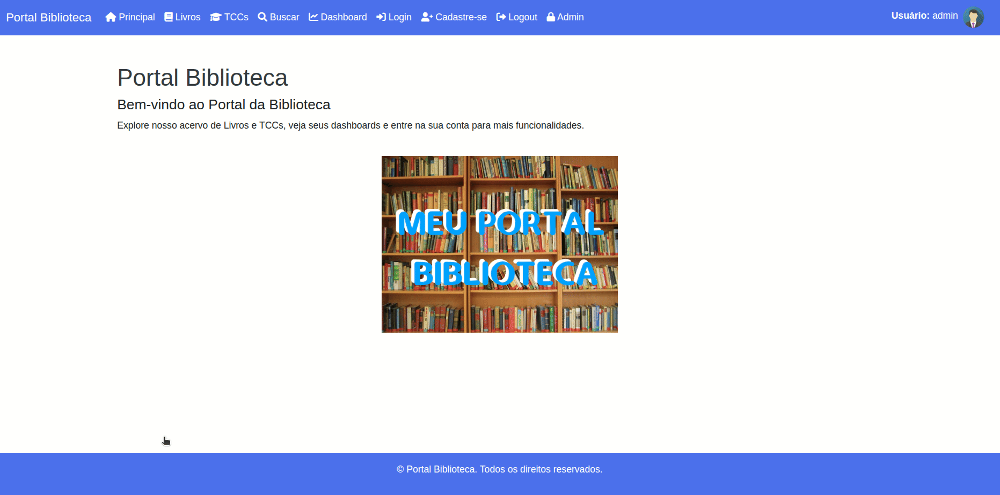

# Aula Django 05 - Sistema para Portal Biblioteca

<p align="center">
  <a href="#">
    
  </a>
  <a href="#">
    
  </a>
  <a href="#">
    
  </a>
</p>

## Índice

* [Introdução](#introdução)
* [Recursos Utilizados](#recursos-utilizados)
* [Objetivo da Aula](#objetivo-da-aula)
* [Desenvolvimento do Projeto](#desenvolvimento-do-projeto)
* [Referências e Materiais de Apoio](#referências-e-materiais-de-apoio)

## Introdução

<a href="#índice"></a>

O objetivo deste tutorial é criar um sistema para gestão de biblioteca usando o framework Python Django. Esse projeto será utilizado na disciplina GAC116 - Programação Web da Universidade Federal de Lavras (UFLA). Esta aula é uma continuação da Aula Django 04.

Este tutorial foi elaborado com base no tutorial disponível no [curso de Django da W3Schools](https://www.w3schools.com/django/index.php) e na [documentação oficial do Django](https://docs.djangoproject.com/pt-br/6.1/).

A aula está organizada no formato de tutorial, permitindo que cada estudante replique em seu computador os conceitos e recursos apresentados. O código será desenvolvido gradualmente, de modo a evidenciar a evolução da solução e facilitar a compreensão de como as tecnologias Django, HTML, CSS e JavaScript se integram na construção de aplicações web.

## Recursos Utilizados

<a href="#índice"></a>

A seguir estão listados os principais recursos empregados no desenvolvimento desta aula.

### Linguagens

* Python - Linguagem de programação principal
  * [Link do site Python](https://www.python.org/)
  * [Link do curso da W3Schools](https://www.w3schools.com/python/default.asp)
* HTML - Responsável pela estrutura da página web
  * [Link do curso da W3Schools](https://www.w3schools.com/html/default.asp)
* CSS - Responsável pela apresentação da página web
  * [Link do curso da W3Schools](https://www.w3schools.com/css/default.asp)
* JavaScript - Responsável pelo comportamento da página web
  * [Link do curso da W3Schools](https://www.w3schools.com/js/default.asp)
* SQL - Linguagem para consultas no banco de dados
  * [Link do curso da W3Schools](https://www.w3schools.com/sql/default.asp)

### Frameworks

* Django - Framework web
  * [Link do site do Django](https://www.djangoproject.com/)
  * [Link do curso da W3Schools](https://www.w3schools.com/django/index.php)
* Bootstrap - Framework CSS
  * [Link do site do Bootstrap](https://getbootstrap.com/)
  * [Link do curso da W3Schools](https://www.w3schools.com/bootstrap5/index.php)

### Bibliotecas

* Jinja - Biblioteca Python para templates
  * [Link do site do Jinja](https://jinja.palletsprojects.com/en/3.1.x/)
* Chart.js - Biblioteca JavaScript para gráficos
  * [Link do site do chart.js](https://www.chartjs.org/)
* FontAwesome - Biblioteca CSS para ícones
  * [Link do site do Fontawesome](https://fontawesome.com/)
  * [Link da documentação Fontawesome](https://docs.fontawesome.com/web/setup/get-started)
  * [Link do curso da W3Schools](https://www.w3schools.com/icons/fontawesome5_intro.asp)
* WhiteNoise - Biblioteca Python para servir arquivos estáticos
  * [Link do site do Whitenoise](https://whitenoise.readthedocs.io/)
* Grappelli - Biblioteca Python para Interface Administrativa do Django
  * [link do django-grappelli](https://django-grappelli.readthedocs.io/)
* Jazzmin - Biblioteca Python para Interface Administrativa do Django
  * [link do django-jazzmin](https://django-jazzmin.readthedocs.io/)
* Unfold - Biblioteca Python para Interface Administrativa do Django
  * [link do django-unfold](https://unfoldadmin.com/)

### Ferramentas

* Visual Studio Code - Ambiente de Desenvolvimento Integrado
  * [Link site Visual Studio](https://code.visualstudio.com/)
* Git - Sistema de controle de versão
  * [Link site do Git](https://git-scm.com/)
* Github - Plataforma de hospedagem e colaboração em projetos de software
  * [Link site do Github](https://github.com/)
* Pip - Gerenciador de pacotes do Python
  * [Link site do Pip](https://pypi.org/project/pip/)
* Venv - Ambiente virtual do Python
  * [Link site do Venv](https://docs.python.org/pt-br/3/library/venv.html)
* SQLite Online - SGBD
  * [Link site SQLite Online](https://sqliteonline.com/)
* DB Browser for SQLite - SGBD
  * [Link site SQLite Browser](https://sqlitebrowser.org/)

## Objetivo da Aula

<a href="#índice"></a>

O objetivo desta aula é dar continuidade à construção do projeto Portal da Biblioteca utilizando o framework Python Django. Aprenderemos a criar scripts para popular o BD com dados artificiais. Definiremos uma nova tela para realização de buscas. Incluiremos imagens para os livros, PDF e resumo para os TCCs. Traduziremos as views que estão no formato FBV para CBV. Entenderemos o que é o ataque XSS e SQL Injection. Por fim, iremos dockerizar a aplicação e trocar o BD SQLite para Postgres.

A animação abaixo mostra de forma visual o resultado esperado nesta aula.



## Desenvolvimento do Projeto

<a href="#índice"></a>

Siga os passos abaixo para alcançar o objetivo da aula.

### Clonar o Repositório

Para iniciar, faça o clone do repositório com o seguinte comando:

```bash
git clone https://github.com/ufla-prog-web/aula-django-05.git
```

### Abrir o Visual Studio Code

Abra o Visual Studio Code (VS Code) na pasta `aula-django-05`.

**Dica:** abra o arquivo `README.md` e selecione a opção `Open Preview to the Side` para visualizar o tutorial lado a lado enquanto desenvolve a aplicação.

**Dica:** abra um terminal utilizando a IDE clicando em `Terminal` e `New Terminal`.

### Navegar até a Pasta do Projeto

Navegue até a pasta do projeto (`code`) dentro da pasta baixada do Github (`aula-django-05`):

```bash
cd aula-django-05/
cd code/
```

### Criar o Ambiente Virtual

Crie um ambiente virtual para isolar as dependências do projeto:

```bash
python3 -m venv venv
```

**Observação:** no exemplo acima, o segundo nome `venv` é o nome que escolhemos para o nosso ambiente virtual (isso pode ser alterado).

### Ativar o Ambiente Virtual

Ative o ambiente virtual no seu computador utilizando o comando:

```bash
source venv/bin/activate
```

### Criar Arquivo Requirements.txt

Crie um arquivo com nome `requirements.txt` dentro da pasta `code` e coloque o seguinte conteúdo:

```text
Django==6.1.1
whitenoise==6.12.0
django-jazzmin==3.0.5
```

O objetivo deste arquivo é reunir todas as dependências do projeto em um só lugar.

### Instalar as Dependências do Projeto

Instale as dependências do projeto dentro do ambiente virtual criado:

```bash
python3 -m pip install -r requirements.txt
```

Para visualizar todas as biblitecas que foram instaladas no sistema, utilize o comando:

```bash
pip freeze
```

### Executar o Projeto

Antes de executar o projeto, aplique as migrações do banco de dados:

```bash
python3 manage.py migrate
```

Em seguida, execute o comando para copiar os arquivos estáticos:

```bash
python3 manage.py collectstatic
```

Inicie a execução do projeto Django:

```bash
python3 manage.py runserver
```

Acesse no navegador a página [http://127.0.0.1:8000/](http://127.0.0.1:8000/).

A aula anterior avançou até aqui.

### Criar Script para Popular Livros

Nesta etapa, para facilitar a criação de dados para validar o BD será criado alguns scripts para popular o banco.

Para isso, crie um pasta dentro da pasta `code` chamada `scripts-bd`. Em seguida, crie um arquivo chamado `popula_livros.py` e coloque o seguinte conteúdo:

```python
import os
import sys
import django

# Caminho base do projeto (um nível acima da pasta scripts-bd)
BASE_DIR = os.path.dirname(os.path.dirname(os.path.abspath(__file__)))
sys.path.append(BASE_DIR)

os.environ.setdefault("DJANGO_SETTINGS_MODULE", "portal_biblioteca.settings")
django.setup()

from biblioteca.models import Livro

# Lista de 50 livros fictícios
livros = [
    {"nome": "O Senhor dos Anéis", "autor": "J.R.R. Tolkien", "ano": 1954},
    {"nome": "A Jornada do Herói", "autor": "Carlos Andrade", "ano": 2001},
    {"nome": "Segredos da Floresta", "autor": "Marina Souza", "ano": 1998},
    {"nome": "O Código da Magia", "autor": "João Pereira", "ano": 2010},
    {"nome": "As Sombras de Orion", "autor": "Fernanda Alves", "ano": 2015},
    {"nome": "Mistérios do Deserto", "autor": "Rafael Costa", "ano": 2003},
    {"nome": "A Última Fortaleza", "autor": "Beatriz Lima", "ano": 2012},
    {"nome": "Crônicas de Fogo", "autor": "Gabriel Martins", "ano": 2017},
    {"nome": "O Enigma do Tempo", "autor": "Juliana Torres", "ano": 2008},
    {"nome": "O Guardião das Estrelas", "autor": "Pedro Rocha", "ano": 2020},
    {"nome": "Reino Submerso", "autor": "Ana Clara Souza", "ano": 1999},
    {"nome": "Os Ventos do Norte", "autor": "Rodrigo Mello", "ano": 2005},
    {"nome": "Além do Horizonte", "autor": "Patrícia Gomes", "ano": 2011},
    {"nome": "Labirinto das Almas", "autor": "André Nogueira", "ano": 2013},
    {"nome": "Portais do Infinito", "autor": "Camila Duarte", "ano": 2018},
    {"nome": "Sombras do Passado", "autor": "Felipe Almeida", "ano": 2007},
    {"nome": "Ecos do Futuro", "autor": "Larissa Monteiro", "ano": 2014},
    {"nome": "A Dança das Espadas", "autor": "Ricardo Tavares", "ano": 2016},
    {"nome": "Estrelas Caídas", "autor": "Carolina Pinto", "ano": 2009},
    {"nome": "A Cidade Perdida", "autor": "Lucas Ferreira", "ano": 2004},
    {"nome": "O Legado dos Deuses", "autor": "Isabela Ramos", "ano": 2019},
    {"nome": "A Maldição do Vale", "autor": "Thiago Barbosa", "ano": 2002},
    {"nome": "Segredos do Oceano", "autor": "Marta Figueiredo", "ano": 2006},
    {"nome": "Caminhos da Eternidade", "autor": "Vinícius Duarte", "ano": 2011},
    {"nome": "O Despertar da Lua", "autor": "Helena Castro", "ano": 2013},
    {"nome": "Império das Areias", "autor": "Maurício Oliveira", "ano": 2017},
    {"nome": "Códigos Ocultos", "autor": "Sofia Mendes", "ano": 2010},
    {"nome": "A Batalha dos Reinos", "autor": "Caio Lima", "ano": 2015},
    {"nome": "O Livro das Sombras", "autor": "Natália Ribeiro", "ano": 2008},
    {"nome": "Chamas do Destino", "autor": "Eduardo Correia", "ano": 2012},
    {"nome": "Os Olhos da Noite", "autor": "Roberta Santos", "ano": 2009},
    {"nome": "Memórias de Aço", "autor": "Diego Moreira", "ano": 2007},
    {"nome": "Segredos da Aurora", "autor": "Letícia Fernandes", "ano": 2016},
    {"nome": "A Espada do Rei", "autor": "Bruno Carvalho", "ano": 2003},
    {"nome": "Mundos Paralelos", "autor": "Tatiane Rocha", "ano": 2021},
    {"nome": "As Crônicas da Tempestade", "autor": "Guilherme Duarte", "ano": 2018},
    {"nome": "O Olhar da Serpente", "autor": "Paula Menezes", "ano": 2005},
    {"nome": "No Coração da Montanha", "autor": "Rogério Almeida", "ano": 2002},
    {"nome": "A Última Profecia", "autor": "Daniela Silva", "ano": 2014},
    {"nome": "O Herdeiro Perdido", "autor": "Marcelo Barros", "ano": 2011},
    {"nome": "Trono de Cinzas", "autor": "Amanda Costa", "ano": 2019},
    {"nome": "O Sussurro das Estrelas", "autor": "Henrique Vasconcelos", "ano": 2006},
    {"nome": "Legado de Sangue", "autor": "Mariana Albuquerque", "ano": 2013},
    {"nome": "As Torres da Eternidade", "autor": "Fábio Nunes", "ano": 2008},
    {"nome": "O Vale Esquecido", "autor": "Patrícia Almeida", "ano": 2004},
    {"nome": "A Canção da Guerra", "autor": "João Marcos Lima", "ano": 2010},
    {"nome": "O Enigma das Estrelas", "autor": "Cláudia Ferreira", "ano": 2015},
    {"nome": "Sombras da Cidade", "autor": "Luiz Henrique", "ano": 2012},
    {"nome": "A Jornada das Almas", "autor": "Renata Pires", "ano": 2009},
    {"nome": "Crônicas de Prata", "autor": "Igor Andrade", "ano": 2017},
]

# Inserindo os livros no banco
for dados in livros:
    livro = Livro(nome=dados['nome'], autor=dados['autor'], ano=dados['ano']) 
    livro.save()
    # Se desejar, o código abaixo também funciona.
    # Livro.objects.create(**dados)

print("50 livros adicionados com sucesso!")
```

Em seguida, execute o código para popular o BD (tabela livros) com dados artificiais:

```bash
python3 scripts-bd/popula_livros.py
```

Verifique se os livros foram populados corretamente.

### Criar Script para Popular TCCs

Agora, iremos popular o BD com dados de TCCs. Assim, crie um arquivo chamado `popula_tccs.py` e coloque o seguinte conteúdo:

```python
import os
import sys
import django

# Caminho base do projeto (um nível acima da pasta scripts-bd)
BASE_DIR = os.path.dirname(os.path.dirname(os.path.abspath(__file__)))
sys.path.append(BASE_DIR)

os.environ.setdefault("DJANGO_SETTINGS_MODULE", "portal_biblioteca.settings")
django.setup()

from biblioteca.models import TCC

# Lista de 50 TCCs fictícios
tccs = [
    {"titulo": "Sistemas Inteligentes para Diagnóstico Médico", "autor": "Ana Silva", "orientador": "Prof. João Souza", "ano": 2020},
    {"titulo": "Reconhecimento Facial com Deep Learning", "autor": "Bruno Oliveira", "orientador": "Prof. Maria Castro", "ano": 2021},
    {"titulo": "Otimização de Rotas em Logística Urbana", "autor": "Carla Mendes", "orientador": "Prof. Ricardo Lima", "ano": 2019},
    {"titulo": "Aplicações de IoT em Agricultura de Precisão", "autor": "Diego Santos", "orientador": "Prof. Fernanda Costa", "ano": 2022},
    {"titulo": "Segurança da Informação em Sistemas Bancários", "autor": "Eduarda Ferreira", "orientador": "Prof. Pedro Rocha", "ano": 2018},
    {"titulo": "Chatbots Educacionais com Processamento de Linguagem Natural", "autor": "Felipe Alves", "orientador": "Prof. Juliana Torres", "ano": 2020},
    {"titulo": "Sistemas de Recomendação para Comércio Eletrônico", "autor": "Gabriela Pinto", "orientador": "Prof. André Nogueira", "ano": 2021},
    {"titulo": "Análise de Sentimento em Redes Sociais", "autor": "Henrique Martins", "orientador": "Prof. Beatriz Lima", "ano": 2022},
    {"titulo": "Aplicações de Blockchain em Saúde", "autor": "Isabela Souza", "orientador": "Prof. Lucas Ferreira", "ano": 2019},
    {"titulo": "Reconhecimento de Padrões em Séries Temporais", "autor": "João Carvalho", "orientador": "Prof. Camila Duarte", "ano": 2017},
    {"titulo": "Realidade Virtual para Treinamento de Profissionais de Saúde", "autor": "Karen Costa", "orientador": "Prof. Thiago Barbosa", "ano": 2020},
    {"titulo": "Análise de Grandes Volumes de Dados Climáticos", "autor": "Leonardo Gomes", "orientador": "Prof. Patrícia Almeida", "ano": 2021},
    {"titulo": "Uso de Redes Neurais em Previsão Financeira", "autor": "Mariana Farias", "orientador": "Prof. Rodrigo Mello", "ano": 2022},
    {"titulo": "Gamificação no Ensino de Programação", "autor": "Nicolas Rocha", "orientador": "Prof. Larissa Monteiro", "ano": 2018},
    {"titulo": "Detecção de Fraudes em Transações Online", "autor": "Otávio Nunes", "orientador": "Prof. Sofia Mendes", "ano": 2019},
    {"titulo": "Assistentes Virtuais com Inteligência Artificial", "autor": "Paula Ribeiro", "orientador": "Prof. Guilherme Duarte", "ano": 2020},
    {"titulo": "Aplicações de Robótica em Reabilitação Física", "autor": "Rafael Correia", "orientador": "Prof. Cláudia Ferreira", "ano": 2021},
    {"titulo": "Mineração de Dados em Educação", "autor": "Sabrina Azevedo", "orientador": "Prof. Igor Andrade", "ano": 2022},
    {"titulo": "Simulação de Tráfego Urbano com Multiagentes", "autor": "Tiago Moreira", "orientador": "Prof. Helena Castro", "ano": 2020},
    {"titulo": "Aplicações de Computação em Nuvem no Setor Público", "autor": "Ursula Pereira", "orientador": "Prof. Marcelo Barros", "ano": 2019},
    {"titulo": "Análise de Desempenho em Redes 5G", "autor": "Vinícius Duarte", "orientador": "Prof. Daniela Silva", "ano": 2021},
    {"titulo": "Desenvolvimento de Jogos Sérios para Educação Ambiental", "autor": "Wagner Lopes", "orientador": "Prof. Amanda Costa", "ano": 2018},
    {"titulo": "Reconhecimento de Emoções por Expressões Faciais", "autor": "Xavier Barbosa", "orientador": "Prof. Henrique Vasconcelos", "ano": 2022},
    {"titulo": "Algoritmos Genéticos aplicados à Engenharia de Tráfego", "autor": "Yasmin Ferreira", "orientador": "Prof. Mariana Albuquerque", "ano": 2020},
    {"titulo": "Processamento de Imagens Médicas com CNNs", "autor": "Zeca Almeida", "orientador": "Prof. Fábio Nunes", "ano": 2021},
    {"titulo": "Redes Neurais para Tradução Automática", "autor": "Alice Moura", "orientador": "Prof. Paula Menezes", "ano": 2017},
    {"titulo": "Desenvolvimento de Sistemas de Controle Embarcados", "autor": "Bruno Henrique", "orientador": "Prof. Rogério Almeida", "ano": 2018},
    {"titulo": "Uso de Drones em Monitoramento Ambiental", "autor": "Carolina Alves", "orientador": "Prof. Renata Pires", "ano": 2019},
    {"titulo": "Classificação de Doenças em Folhas de Plantas", "autor": "Daniel Costa", "orientador": "Prof. Luiz Henrique", "ano": 2020},
    {"titulo": "Análise de Redes Complexas em Biologia", "autor": "Eduardo Lima", "orientador": "Prof. Cláudia Ferreira", "ano": 2021},
    {"titulo": "Sistemas de Apoio à Decisão em Saúde", "autor": "Fernanda Rocha", "orientador": "Prof. João Marcos", "ano": 2022},
    {"titulo": "Estudo de Criptografia Quântica", "autor": "Gabriel Souza", "orientador": "Prof. Tatiane Rocha", "ano": 2019},
    {"titulo": "Aplicações de Inteligência Artificial no Direito", "autor": "Helena Fernandes", "orientador": "Prof. Maurício Oliveira", "ano": 2020},
    {"titulo": "Modelagem de Processos Biológicos com Redes Bayesianas", "autor": "Igor Castro", "orientador": "Prof. Larissa Monteiro", "ano": 2021},
    {"titulo": "Análise de Big Data em Redes Sociais", "autor": "Juliana Lopes", "orientador": "Prof. Ricardo Tavares", "ano": 2022},
    {"titulo": "Sistemas Inteligentes para Previsão de Demanda Elétrica", "autor": "Kleber Alves", "orientador": "Prof. Beatriz Lima", "ano": 2018},
    {"titulo": "Simulação de Desastres Naturais com Modelos Computacionais", "autor": "Laura Pereira", "orientador": "Prof. Camila Duarte", "ano": 2020},
    {"titulo": "Arquiteturas de Microserviços em Aplicações Web", "autor": "Marcelo Vieira", "orientador": "Prof. Juliana Torres", "ano": 2021},
    {"titulo": "Aplicação de Redes Neurais em Reconhecimento de Voz", "autor": "Natália Cunha", "orientador": "Prof. André Nogueira", "ano": 2019},
    {"titulo": "Estudo de Sistemas Multiagentes em Logística", "autor": "Otávio Ramos", "orientador": "Prof. Rodrigo Mello", "ano": 2022},
    {"titulo": "Uso de Realidade Aumentada no Ensino Fundamental", "autor": "Paulo Henrique", "orientador": "Prof. Patrícia Almeida", "ano": 2018},
    {"titulo": "Classificação de Imagens de Satélite com Machine Learning", "autor": "Renata Martins", "orientador": "Prof. Juliana Torres", "ano": 2020},
    {"titulo": "Sistemas de Detecção de Intrusos em Redes", "autor": "Sérgio Carvalho", "orientador": "Prof. Pedro Rocha", "ano": 2021},
    {"titulo": "Estudo de Algoritmos de Compressão de Dados", "autor": "Tânia Gomes", "orientador": "Prof. Rafael Costa", "ano": 2019},
    {"titulo": "Análise de Mobilidade Urbana com Dados de GPS", "autor": "Ulisses Rocha", "orientador": "Prof. Fernanda Costa", "ano": 2022},
    {"titulo": "Reconhecimento de Objetos em Vídeos", "autor": "Vera Monteiro", "orientador": "Prof. Eduardo Correia", "ano": 2020},
    {"titulo": "Aplicações de Robótica em Agricultura", "autor": "Wesley Santos", "orientador": "Prof. Lucas Ferreira", "ano": 2021},
    {"titulo": "Estudo de Heurísticas para Problema do Caixeiro Viajante", "autor": "Xênia Duarte", "orientador": "Prof. Rodrigo Mello", "ano": 2017},
    {"titulo": "Previsão de Desempenho Acadêmico com Machine Learning", "autor": "Yago Almeida", "orientador": "Prof. Mariana Albuquerque", "ano": 2020},
    {"titulo": "Sistemas de Recomendação de Filmes", "autor": "Zilda Farias", "orientador": "Prof. Bruno Carvalho", "ano": 2021},
]

# Inserindo os TCCs no banco
for dados in tccs:
    livro = TCC(titulo=dados['titulo'], autor=dados['autor'], orientador=dados['orientador'], ano=dados['ano']) 
    livro.save()
    # Se desejar, o código abaixo também funciona.
    # TCC.objects.create(**dados)

print("50 TCCs adicionados com sucesso!")
```

Em seguida, execute o código para popular o BD (tabela TCCs) com dados artificiais:

```bash
python3 scripts-bd/popula_tccs.py
```

Verifique se os TCCs foram populados corretamente.

### Criar Script para Deletar Livros

Agora, iremos criar um script para deletar os livros do BD. Assim, crie um arquivo chamado `deleta_livros.py` e coloque o seguinte conteúdo:

```python
import os
import sys
import django

# Caminho base do projeto (um nível acima da pasta scripts-bd)
BASE_DIR = os.path.dirname(os.path.dirname(os.path.abspath(__file__)))
sys.path.append(BASE_DIR)

os.environ.setdefault("DJANGO_SETTINGS_MODULE", "portal_biblioteca.settings")
django.setup()

from biblioteca.models import Livro

total, _ = Livro.objects.all().delete()

print(f"Todos os livros foram deletados! Total de registros deletados: {total}")
```

Caso deseje deletar os livros do BD, execute o código abaixo:

```bash
python3 scripts-bd/deleta_livros.py
```

### Criar Script para Deletar TCCs

Agora, iremos criar um script para deletar os TCCs do BD. Assim, crie um arquivo chamado `deleta_tccs.py` e coloque o seguinte conteúdo:

```python
import os
import sys
import django

# Caminho base do projeto (um nível acima da pasta scripts-bd)
BASE_DIR = os.path.dirname(os.path.dirname(os.path.abspath(__file__)))
sys.path.append(BASE_DIR)

os.environ.setdefault("DJANGO_SETTINGS_MODULE", "portal_biblioteca.settings")
django.setup()

from biblioteca.models import TCC

total, _ = TCC.objects.all().delete()

print(f"Todos os TCCs foram deletados! Total de registros deletados: {total}")
```

Caso deseje deletar os TCCs do BD, execute o código abaixo:

```bash
python3 scripts-bd/deleta_tccs.py
```

### Incluir Busca por Livros ou TCCs

Nesta etapa, iremos incluir um campo de busca de materiais do BD (livros e TCCs). Para isso, inclua no arquivo `base.html`:

```html
...
<li class="nav-item">
    <a class="nav-link active" href="/tccs"><i class="fas fa-graduation-cap"></i> TCCs</a>
</li>
<li class="nav-item"> <!--Link Incluído-->
    <a class="nav-link active" href="/busca"><i class="fa-solid fa-magnifying-glass"></i> Buscar</a>
</li>                            
<li class="nav-item">
    <a class="nav-link active" href="/dashboard"><i class="fas fa-chart-line"></i> Dashboard</a>
</li>
...
```

Crie um arquivo chamado `busca.html` e salva na pasta `biblioteca/templates`, com o conteúdo:

```html





    Portal Biblioteca - Busca



<div class="container mt-4">
    <h2 class="mb-4">Busca no Acervo</h2>

    <!-- Formulário de busca -->
    <form method="get" action="" class="mb-4">
        <div class="input-group">
            <input type="text" name="q" value="{{ query|default:'' }}" class="form-control" placeholder="Digite título, autor ou ano...">
            <button class="btn btn-primary" type="submit">Buscar</button>
        </div>
    </form>

    
        <h5>Resultados para: <strong>{{ query }}</strong></h5>
    

    <!-- Resultados para Livros -->
    
        <h4 class="mt-4">📚 Livros</h4>
        <div class="row">
            
            <div class="col-md-4 mb-3">
                <div class="card h-100">
                    <div class="card-body">
                        <h5 class="card-title">{{ livro.nome }}</h5>
                        <p class="card-text">
                            <strong>Autor:</strong> {{ livro.autor }} <br>
                            <strong>Ano:</strong> {{ livro.ano }} <br>
                        </p>
                    </div>
                </div>
            </div>
            
        </div>
    

    <!-- Resultados para TCCs -->
    
        <h4 class="mt-4">📄 Trabalhos de Conclusão de Curso (TCC)</h4>
        <div class="row">
            
            <div class="col-md-4 mb-3">
                <div class="card h-100">
                    <div class="card-body">
                        <h5 class="card-title">{{ tcc.titulo }}</h5>
                        <p class="card-text">
                            <strong>Autor:</strong> {{ tcc.autor }} <br>
                            <strong>Ano:</strong> {{ tcc.ano }} <br>
                            <a href="/tccs/detalhes/{{ tcc.id }}" class="btn btn-sm btn-outline-primary">Ver Detalhes</a>
                        </p>
                    </div>
                </div>
            </div>
            
        </div>
    

    <!-- Caso não haja resultados -->
    
        <div class="alert alert-warning mt-4">
            Nenhum resultado encontrado para sua busca.
        </div>
    
</div>

```

Inclua no arquivo `biblioteca/view.py`:

```python
from django.db.models import Q    # biblioteca adicionada
...

def busca(request):               # função adicionada
    query = request.GET.get("q")
    livros = []
    tccs = []
    if query:
        livros = Livro.objects.filter(
            Q(nome__icontains=query) | Q(autor__icontains=query) | Q(ano__icontains=query)
        )
        tccs = TCC.objects.filter(
            Q(titulo__icontains=query) | Q(autor__icontains=query) | Q(ano__icontains=query) | Q(orientador__icontains=query)
        )
    context = {
        "livros": livros, 
        "tccs": tccs, 
        "query": query
    }
    template = loader.get_template('busca.html')
    return HttpResponse(template.render(context, request))
```

Em seguida, inclua no arquivo `biblioteca/urls.py`:

```python
...
urlpatterns = [
    ...
    path('busca', views.busca, name='busca'),   # linha incluída
]
...
```

Execute o projeto Django:

```bash
python3 manage.py runserver
```

Acesse no navegador a página [http://127.0.0.1:8000/busca](http://127.0.0.1:8000/busca) e analise o resultado para diferentes buscas.

### Incluir Imagem de Capa para Livro

Nesta etapa, iremos incluir uma imagem de capa para os livros. Além disso, iremos colocar mais livros lado a lado para melhorar a visualização. Outra alteração foi uma mensagem caso não tenham livros cadastrados.

Para isso, troque o conteúdo do arquivo `biblioteca/templates/livro.html` para o conteúdo abaixo:

```html



    Portal Biblioteca - Livros



    <main class="container mt-5">
         <!--atualizei as linhas abaixo-->
            <h4 class="mt-4">Livros Cadastrados</h4>
            <div class="row">
                
                <div class="col-md-4 mb-3">
                    <div class="card">
                        <div class="card-body d-flex align-items-start">
                            <!-- Imagem à esquerda -->
                            <div class="me-3">
                                
                            </div>
                            <!-- Texto à direita -->
                            <div>
                                <h5 class="card-title"><strong>Título:</strong> {{ livro.nome }}</h5>
                                <p class="card-text mb-1"><strong>Autor:</strong> {{ livro.autor }}</p>
                                <p class="card-text mb-1"><strong>Ano:</strong> {{ livro.ano }}</p>
                            </div>
                        </div>
                    </div>
                </div>
                
            </div>
        
            <h3 class="mt-4">Nenhum livro encontrado.</h3>
        
    </main>

```

Modifique o modelo livro para receber a imagem do livro como no código abaixo:

```python
class Livro(models.Model):
    ...
    imagem = models.ImageField(upload_to="livros/", default="livros/capa_padrao.png") # linha adicionada
```

Instale a biblioteca Pillow com o comando abaixo:

```bash
python -m pip install Pillow
```

Atualize o arquivo de `requirements.txt` como abaixo:

```text
Django==6.0.5
whitenoise==6.12.0
django-jazzmin==3.0.5
pillow==12.3.0
```

Execute os comandos:

```bash
python3 manage.py makemigrations
python3 manage.py migrate
```

Inclua as seguintes linhas no arquivo `settings.py`:

```python
DEBUG = True                     # alterei essa linha para True

STATICFILES_DIRS = [
    BASE_DIR / 'static'
]

MEDIA_URL = "/media/"            #linha adicionada
MEDIA_ROOT = BASE_DIR / "media"  #linha adicionada
```

**Observação:** como estamos em desenvolvimento, voltamos a variável `DEBUG` para `True`. A biblioteca WhiteNoise só serve arquivos estáticos (fixos da pasta `static`), a bibliteca WhiteNoise não consegue servir arquivos dinâmicos, ou seja, enviados pelo usuário para a pasta `media`. Em produção esses arquivos serão servidos pelo servidor web como o ngnix. Com `DEBUG` igual a `True` (desenvolvimento) o Django consegue servir esses arquivos normalmente, mas não é seguro para produção.

Altere o arquivo `view.py` na linha que recebe os objetos livros, conforme abaixo:

```python
def livros(request):
    livros = Livro.objects.all()  # atualizei essa linha
    context = {
        'livros': livros
    }
    template = loader.get_template('livros.html')
    return HttpResponse(template.render(context, request))
```

No arquivo `urls.py` da pasta `biblioteca`, realize as alterações abaixo:

```python
...
from django.conf import settings             #linha incluída
from django.conf.urls.static import static   #linha incluída

urlpatterns = [
    path('', include('biblioteca.urls')),
    path('admin/', admin.site.urls),
    path('auth/', include('usuarios.urls')),
]

if settings.DEBUG:                           # condição incluída
    urlpatterns += static(settings.MEDIA_URL, document_root=settings.MEDIA_ROOT)
```

Copie o arquivo `capa_padrao.png` (da pasta `recursos`) para dentro da pasta `code/media/livros/`. Se a pasta `media` e `livros` ainda não foram criadas crie as mesmas.

Execute o projeto Django:

```bash
python3 manage.py runserver
```

Acesse no navegador a página [http://127.0.0.1:8000/livros](http://127.0.0.1:8000/livros).

Experimente acessar o ambiente administrativo e cadastrar outra capa para os livros. Em seguida, visualize o resultado na tela de livros.

### Incluir Arquivo PDF e Resumo no TCC

Nesta etapa, iremos incluir um arquivo de PDF e um resumo para os TCCs. Além disso, iremos colocar mais TCCs lado a lado para melhorar a visualização. Outra alteração foi uma mensagem caso não tenham TCCs cadastrados.

Para isso, troque o conteúdo do arquivo `biblioteca/templates/tccs.html` para o conteúdo abaixo:

```html



    Portal Biblioteca - TCCs



    <main class="container mt-5">
         <!--atualizei as linhas abaixo-->
            <h4 class="mt-4">TCCs Cadastrados</h4>
            <div class="row">
                
                <div class="col-md-4 mb-3">
                    <div class="card">
                        <div class="card-body align-items-start">
                            <p class="card-title"><strong>Título:</strong> {{ tcc.titulo }}</p>
                            <p class="card-text mb-1"><strong>Autor:</strong> {{ tcc.autor }}</p>
                            <center><a href="/tccs/detalhes/{{ tcc.id }}" class="btn btn-primary">Ver Detalhes</a></center>
                        </div>
                    </div>
                </div>
                
            </div>
        
            <h3 class="mt-4">Nenhum TCC encontrado.</h3>
        
    </main>

```

Em seguida, atualize o conteúdo do arquivo `tcc_detalhes.html` para o código abaixo:

```html



    Portal Biblioteca - TCC - Detalhes



    <main class="container mt-5">
        <h1>Trabalho de Conclusão de Curso - Detalhes</h1>  
        <div class="card">
            <div class="card-header card-title-obra">
                <em>Título:</em> {{ tcc.titulo }}
            </div>
            <div class="card-body">
                <p class="card-title"><em>Autor:</em> {{ tcc.autor }}</p>
                <p class="card-title"><em>Orientador:</em> {{ tcc.orientador }}</p>
                <p class="card-title"><em>Ano:</em> {{ tcc.ano }}</p>
                 <!-- atualzei -->
                    <h5>Resumo:</h5>
                    <p>{{ tcc.resumo }}</p>
                
                <a href="{{ tcc.arquivo_pdf.url }}" class="btn btn-primary" target="_blank">Ver PDF</a> <!-- atualzei -->
            </div>
        </div>
        <br>
        <center><a href="/tccs" class="btn btn-primary">Voltar</a></center>
    </main>

```

Modifique o modelo TCC para receber o resumo e o arquivo PDF do TCC como no código abaixo:

```python
class TCC(models.Model):
    ...
    resumo = models.TextField(blank=True, null=True)                                 # linha adicionada
    arquivo_pdf = models.FileField(upload_to="tccs/", default="tccs/pdf_padrao.pdf") # linha adicionada
```

Execute os comandos:

```bash
python3 manage.py makemigrations
python3 manage.py migrate
```

Copie o arquivo `pdf_padrao.pdf` (da pasta `recursos`) para dentro da pasta `code/media/tccs/`. Se a pasta `tccs` ainda não foi criada crie a mesma.

Execute o projeto Django:

```bash
python3 manage.py runserver
```

Acesse no navegador a página [http://127.0.0.1:8000/tccs](http://127.0.0.1:8000/tccs), clique em um TCC e clique em ver PDF.

Experimente acessar o ambiente administrativo e cadastrar um PDF para os TCCs. Um PDF de exemplo pode ser encontrado dentro da pasta recursos. Experimente cadastrar também um resumo para o TCC. Em seguida, visualize o resultado na tela de TCCs.

### Compreendendo o Que é CBV

Nessa etapa, iremos entender o que é uma *Class Based Views* (CBV), mas para isso é importante também entender que as views que criamos estão no formato *Function Based Views* (FBV).

Uma FBV é uma view implementada como uma **função Python** que recebe uma requisição HTTP e retorrna uma resposta HTTP.

Abaixo temos um exemplo simples de uma FBV (`views.py`):

```python
from django.shortcuts import render

def principal(request):
    return render(request, "principal.html")
```

Já o arquivo de `urls.py` fica assim:

```python
from django.urls import path
from . import views

urlpatterns = [
    path('', views.principal, name='principal'),
]
```

Repare que esse formato de view é o que trabalhamos até agora, ou seja, as views que criamos estão no formato FBV.

Uma outra opção para criar as views é criar uma CBV. No Django, *Class Based Views* (CBV) são views implementadas como classes Python, em vez de funções.

Uma CBV equivalente ao exemplo acima é apresentado abaixo (`views.py`):

```python
from django.views import View
from django.shortcuts import render

class PrincipalView(View):
    def get(self, request):
        return render(request, "principal.html")
```

Já o arquivo de `urls.py` fica assim:

```python
from django.urls import path
from .views import PrincipalView

urlpatterns = [
    path("", PrincipalView.as_view(), name="principal"),
]
```

O método `as_view()` transforma a classe em uma view que o Django consegue usar.

A grande vantagem das CBVs é que elas permitem organizar melhor comportamentos diferentes da mesma página. Por exemplo:

```python
class LivroView(View):

    def get(self, request):
        # exibir formulário
        return render(request, "livro.html")

    def post(self, request):
        # processar formulário
        ...
```

Aqui:

* `get()` trata requisições GET
* `post()` trata requisições POST

Além disso, o Django fornece várias CBVs prontas, muito úteis para CRUD: ListView, DetailView, CreateView, UpdateView e DeleteView.

### Transformar as Views em CBV

Primeiramente, iremos transformar a view `principal` em uma `TemplateView`, para isso troque:

```python
def principal(request):
    template = loader.get_template('principal.html')
    return HttpResponse(template.render({}, request))
```

Por esse código abaixo:

```python
...
from django.views.generic import TemplateView

class PrincipalView(TemplateView):
    template_name = "principal.html"
...
```

No arquivo de `biblioteca/urls.py` troque:

```python
...
    path('', views.principal, name='principal'), # remova 
...
```

Por:

```python
from .views import PrincipalView # inclua essa importação
...

    path('', PrincipalView.as_view(), name='principal'), # inclua essa linha
```

Repare que o código da view ficou ligeiramente menor e mais limpo.

Execute a aplicação e a mesma deve continuar a funcionar da mesma forma.

Agora, iremos transformar a view `livros` em uma ListView, para isso troque:

```python
def livros(request): 
    livros = Livro.objects.all()
    context = {
        'livros': livros
    }
    template = loader.get_template('livros.html')
    return HttpResponse(template.render(context, request))
```

Por essa classe:

```python
...
from django.views.generic import ListView

class LivroListView(ListView):
    model = Livro
    template_name = "livros.html"
    context_object_name = "livros"
...
```

**Explicação:** O Django automaticamente executará algo equivalente a `Livro.objects.all()` e enviará para o template.

No arquivo de `biblioteca/urls.py` troque:

```python
...
    path('livros/', views.livros, name='livros'), # remova 
...
```

Por:

```python
from .views import LivroListView # inclua essa importação
...
    path('livros/', LivroListView.as_view(), name='livros'), # inclua essa linha
...
```

Execute a aplicação e a mesma deve continuar a funcionar da mesma forma.

Agora, iremos transformar a view `tccs` em uma ListView, para isso troque:

```python
def tccs(request):
    tccs = TCC.objects.all().values()
    context = {
        'tccs': tccs,
    }
    template = loader.get_template('tccs.html')
    return HttpResponse(template.render(context, request))
```

Por essa classe:

```python
...

class TCCListView(ListView):
    model = TCC
    template_name = "tccs.html"
    context_object_name = "tccs"
...
```

No arquivo de `biblioteca/urls.py` troque:

```python
...
    path('tccs', views.tccs, name='tccs'), # remova 
...
```

Por:

```python
from .views import TCCListView # inclua essa importação
...
    path('tccs/', TCCListView.as_view(), name='tccs'), # inclua essa linha
...
```

Execute a aplicação e a mesma deve continuar a funcionar da mesma forma.

Agora, iremos transformar a view `tcc_detalhes` em uma DetailView, para isso troque:

```python
def tcc_detalhes(request, id):
    tcc = TCC.objects.get(id=id)
    context = {
        'tcc': tcc,
    }
    template = loader.get_template('tcc_detalhes.html')
    return HttpResponse(template.render(context, request))
```

Por essa classe:

```python
from django.views.generic import DetailView
...

class TCCDetailView(DetailView):
    model = TCC
    template_name = "tcc_detalhes.html"
    context_object_name = "tcc"
...
```

No arquivo de `biblioteca/urls.py` troque:

```python
...
    path('tccs/detalhes/<int:id>', views.tcc_detalhes, name='tcc_detalhes'), # remova 
...
```

Por:

```python
from .views import TCCDetailView # inclua essa importação
...
    path('tccs/detalhes/<int:pk>/', TCCDetailView.as_view(), name='tcc_detalhes'), # inclua essa linha
...
```

Execute a aplicação e a mesma deve continuar a funcionar da mesma forma.

Uma das principais ideias das CBVs genéricas do Django é reutilizar comportamentos muito comuns em aplicações web.

### Entender o Ataque XSS

No contexto do Django, XSS (*Cross-Site Scripting*) é uma vulnerabilidade em que um usuário mal-intencionado consegue inserir código JavaScript em uma página web e fazer esse código ser executado no navegador de outros usuários.

Para ilustrar como esse ataque funciona, modifique a linha abaixo do arquivo `busca.html`:

```html

    <h5>Resultados para: <strong>{{ query }}</strong></h5>

```

Por essa linha:

```html

    <h5>Resultados para: <strong>{{ query | safe }}</strong></h5>

```

Repare que foi incluido um filtro `| safe` na query. Isso irá gerar uma brecha de segurança na aplicação.

Agora, com a aplicação sendo executada vá na página de busca e entre com o seguinte código no campo de busca ao acervo e clique em buscar:

```javascript
<script>
    alert("Ataque XSS")
</script>
```

Repare que o site executou o javascript enviado em um campo de formulário.

Agora, experimente enviar o código abaixo:

```javascript
<script>
    document.body.innerHTML = "Página modificada";
</script>
```

Repare que o site executou o javascript enviado e modificou o conteúdo da página.

Você pode também cadastrar código HTML não só Javascript. Envie o código abaixo e veja a saída na tela de busca.

```html
<ul><li>Cadastrei uma listagem HTML</li></ul>
```

Outro teste que pode ser feito é enviar o javascript pela URL.

Repare que a URL da página de busca possui o seguinte formato:

```text
/busca?q=
```

Assim, entre com a seguinte URL:

```text
/busca/?q=<script>alert("Executando XSS")</script>
```

Repare que o javascript também foi executado. Ou seja, temos brechas de segurança em envio de javascript via GET e também via POST.

O teste abaixo mostra que podemos criar uma interface/formulário falso na aplicação do cliente. Entre no campo de busca ao acervo com o código abaixo:

```html
<div>
    <h3>Sua sessão expirou</h3>

    <form>
        <label>Usuário</label>
        <input type="text">

        <label>Senha</label>
        <input type="password">

        <button>Entrar</button>
    </form>
</div>
```

Realize a busca e veja como isso pode ser perigoso.

Para que não seja possível executar código javascript enviado por formulários ou URL nunca coloque o filtro `| safe` como na linha `<h5>Resultados para: <strong>{{ query | safe }}</strong></h5>` do arquivo `busca.html`.

**Dica:** Não use safe em conteúdo fornecido pelo usuário, a menos que esse conteúdo tenha sido sanitizado adequadamente.

Assim, iremos alterar novamente a linha:

```html

    <h5>Resultados para: <strong>{{ query | safe }}</strong></h5>

```

Por essa linha:

```html

    <h5>Resultados para: <strong>{{ query }}</strong></h5>

```

Dessa maneira, o Django irá transformar o script em algo equivalente a:

```text
&lt;script&gt;alert("XSS")&lt;/script&gt;
```

O navegador mostra apenas o texto, mas não executa o código:

```text
<script>alert("XSS")</script>
```

Isso é uma proteção muito importante do Django.

**O que um XSS pode fazer?**

Dependendo da aplicação, um XSS pode:

* modificar o conteúdo da página;
* executar ações em nome do usuário;
* capturar informações exibidas na página;
* redirecionar o usuário;
* criar formulários falsos;
* fazer requisições usando a sessão do usuário.

Por isso, XSS é uma vulnerabilidade importante em aplicações web.

### Entender o Ataque SQL Injection

O SQL Injection (**SQLi**) é uma vulnerabilidade em que dados fornecidos pelo usuário acabam sendo interpretados como parte do comando SQL, permitindo alterar a consulta que a aplicação pretendia executar.

Para mostrar como o SQL Injection funciona, iremos realizar uma alteração na forma como a busca é realizada. Para isso, altere a view `busca` para o código abaixo:

```python
...
def busca(request):
    query = request.GET.get("q")
    livros = Livro.objects.raw(f"SELECT * FROM biblioteca_livro WHERE nome = '{query}'")
    tccs = TCC.objects.raw(f"SELECT * FROM biblioteca_tcc WHERE titulo = '{query}'")
    context = {
        "livros": livros, 
        "tccs": tccs, 
        "query": query
    }
    template = loader.get_template('busca.html')
    return HttpResponse(template.render(context, request))
```

Repare que no exemplo acima foi criado dois códigos SQL. Se o usuário buscar o nome de um livro ou TCC não haverá problemas. Assim, se o usuário digitar "O Senhor dos Anéis" e mandar buscar não haverá problemas.

O problema aparece se o usuário fornecer algo como:

```text
' OR '1'='1
```

A consulta resultante seria:

```sql
SELECT * FROM biblioteca_livro WHERE nome = '' OR '1'='1';
```

Como a string "1" é igual a "1" então todos os livros serão exibidos. Da mesma forma todos os TCCs.

Mas então como evitar SQL Injection no Django? Uma grande vantagem do Django é que o ORM já protege você na maioria das situações comuns de SQL Injection.

Em vez de escrever:

```sql
sql = f"""SELECT * FROM biblioteca_livroWHERE titulo = '{titulo}'"""
```

faça:

```python
livros = Livro.objects.filter(titulo=titulo)
```

Se ainda assim for necessário escrever o código SQL, o correto é parametrizar. Veja o exemplo abaixo:

```python
livros = Livro.objects.raw("SELECT * FROM biblioteca_livro WHERE nome = %s", [query])
```

Dessa forma, não é possível realizar o ataque por SQL Injection.

Antes de proceguir não esqueça de voltar o conteúdo da busca para o código original como abaixo:

```python
def busca(request):
    query = request.GET.get("q")
    livros = []
    tccs = []
    if query:
        livros = Livro.objects.filter(
            Q(nome__icontains=query) | Q(autor__icontains=query) | Q(ano__icontains=query)
        )
        tccs = TCC.objects.filter(
            Q(titulo__icontains=query) | Q(autor__icontains=query) | Q(ano__icontains=query) | Q(orientador__icontains=query)
        )
    context = {
        "livros": livros, 
        "tccs": tccs, 
        "query": query
    }
    template = loader.get_template('busca.html')
    return HttpResponse(template.render(context, request))
```

### Dockerizar a Aplicação

Nesta etapa, iremos colocar a nossa aplicação dentro de um conteiner do Docker. Pré-requisito: É necessário possuir o Docker e Docker Compose instalados na máquina.

Primeiramente, garanta que o arquivo `requirements.txt` na pasta `code` esteja com todas as bibliotecas listadas.

Crie um arquivo `Dockerfile` na pasta `code` com o conteúdo abaixo:

```dockerfile
# Usando uma imagem base oficial e leve do Python
FROM python:3.13-slim

# Configurações para o Python não salvar arquivos .pyc e não reter buffers de saída
ENV PYTHONDONTWRITEBYTECODE=1
ENV PYTHONUNBUFFERED=1

# Definindo o diretório de trabalho dentro do container
WORKDIR /app

# Copiando o arquivo de dependências para o container
COPY requirements.txt .

# Atualiza o gerenciador de pacotes Python e instala as dependências do projeto
RUN pip install --upgrade pip
RUN pip install -r requirements.txt

# Copiando o restante do código do projeto para o container
COPY . .

# Coletando os arquivos estáticos do Django para servir em produção
RUN python manage.py collectstatic --noinput

# Expondo a porta 8000 para acessar a aplicação Django
EXPOSE 8000

# Comando para iniciar o servidor em desenvolvimento
CMD ["python", "manage.py", "runserver", "0.0.0.0:8000"]
```

Crie um arquivo `docker-compose.yml` na pasta `code` com o conteúdo abaixo:

```yaml
services:
  # Serviço da Aplicação Django
  web:
    build: .
    container_name: portal_biblioteca
    ports:
      - "8000:8000"
    volumes:
      - .:/app
    command: >
      sh -c "python manage.py migrate &&
            python manage.py runserver 0.0.0.0:8000"
```

Agora, execute o comando (antes é necessário abrir o Docker Desktop):

```bash
docker compose up --build -d
```

Então, acesse [http://localhost:8000](http://localhost:8000).

### Trocar SQLite para Postgres

Nesta etapa, iremos trocar o banco de dados SQLite para o Postgres.

Primeiramente, adicione a biblioteca psycopg2-binary no arquivo `requirements.txt` conforme abaixo:

```text
Django==6.1.1
whitenoise==6.12.0
django-jazzmin==3.0.5
pillow==12.3.0
psycopg2-binary==2.9.13
```

**Explicação:** A biblioteca psycopg2-binary é um adaptador que permite o Python se conectar com o banco de dados Postgres.

Troque o conteúdo do arquivo `docker-compose.yml` na pasta `code` para o conteúdo abaixo:

```yaml
services:
  web:
    build: .
    container_name: portal_biblioteca
    ports:
      - "8000:8000"

    volumes:
      - .:/app

    env_file:
      - env.conf

    depends_on:
      db:
        condition: service_healthy
    
    command: >
      sh -c "python manage.py migrate &&
             python manage.py runserver 0.0.0.0:8000"

  db:
    image: postgres:16

    container_name: portal_biblioteca_db

    env_file:
      - env.conf
    
    volumes:
      - postgres_data:/var/lib/postgresql/data

    healthcheck:
      test: ["CMD-SHELL", "pg_isready -U postgres -d portal_biblioteca"]
      interval: 5s
      timeout: 5s
      retries: 5

volumes:
  postgres_data:
```

**Explicação:** Com o código acima dois conteiners serão criados um para a aplicação web do portal da biblioteca e outro para o banco de dados do portal.

Em seguida, troque o conteúdo do arquivo `settings.py`:

```python
DATABASES = {
    'default': {
        'ENGINE': 'django.db.backends.sqlite3',
        'NAME': BASE_DIR / 'db.sqlite3',
    }
}
```

Para o conteúdo abaixo:

```python
import os # biblioteca adicionada

...

DATABASES = {
    'default': {
        'ENGINE': 'django.db.backends.postgresql',
        'NAME': os.environ.get('POSTGRES_DB'),
        'USER': os.environ.get('POSTGRES_USER'),
        'PASSWORD': os.environ.get('POSTGRES_PASSWORD'),
        'HOST': os.environ.get('POSTGRES_HOST'),
        'PORT': os.environ.get('POSTGRES_PORT'),
    }
}
```

Crie um arquivo `env.conf` na pasta `code` com o seguinte conteúdo:

```conf
POSTGRES_DB=portal_biblioteca
POSTGRES_USER=postgres
POSTGRES_PASSWORD=postgres
POSTGRES_HOST=db
POSTGRES_PORT=5432
```

**Atenção:** Em produção as senhas devem ser trocadas para senhas mais seguras. Além disso, o arquivo `env.conf` não deve ser versionado. É comum criar um arquivo `env_sample.conf` que contém apenas as propriedades sem os valores. Por ser um tutorial simples não faremos esse passo.

Agora, execute o comando (antes é necessário abrir o Docker Desktop):

```bash
docker compose down
docker compose up --build -d
```

Então, acesse [http://localhost:8000](http://localhost:8000) e verifique se está funcionando. Perceba que o BD está vazio.

### Cadastrar Dados no BD Postgres

Execute o passo abaixo para criar um usuário administrador do sistema.

```bash
docker compose exec web python manage.py createsuperuser
```

Execute o passo abaixo para acessar o BD do postgres.

```bash
docker compose exec db psql -U postgres -d portal_biblioteca
```

E dentro do PostgreSQL execute o comando abaixo para listar as tabelas criadas pelo Django:

```bash
\dt
```

Execute o comando abaixo para popular livros no BD postgres.

```bash
docker compose exec web python scripts-bd/popula_livros.py
```

Execute o comando abaixo para popular TCCs no BD postgres.

```bash
docker compose exec web python scripts-bd/popula_tccs.py
```

## Referências e Materiais de Apoio

<a href="#índice"></a>

Este tutorial foi baseado nos seguintes materiais:

* [Documentação oficial do Django](https://docs.djangoproject.com/pt-br/5.0/)
* [Curso de Django da W3Schools](https://www.w3schools.com/django/index.php)
